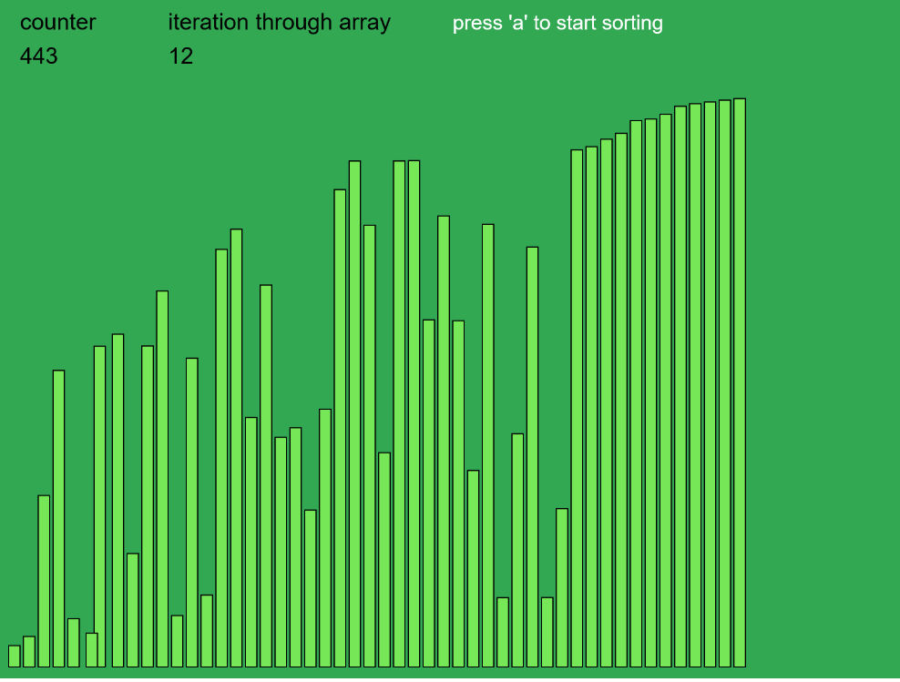

# Overview

This project is created to visualize **Bubble Sort Algorithm**.
Also I wanted to use and play with `p5.js` framework to do some drawing and animations.
I will also create the same thing with C++ and SDL or SFML2 library.
The same goes for other sorting algorithms.

# Screenshot

